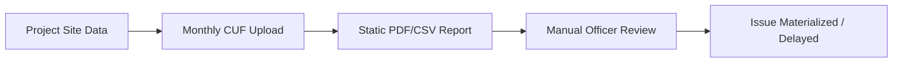
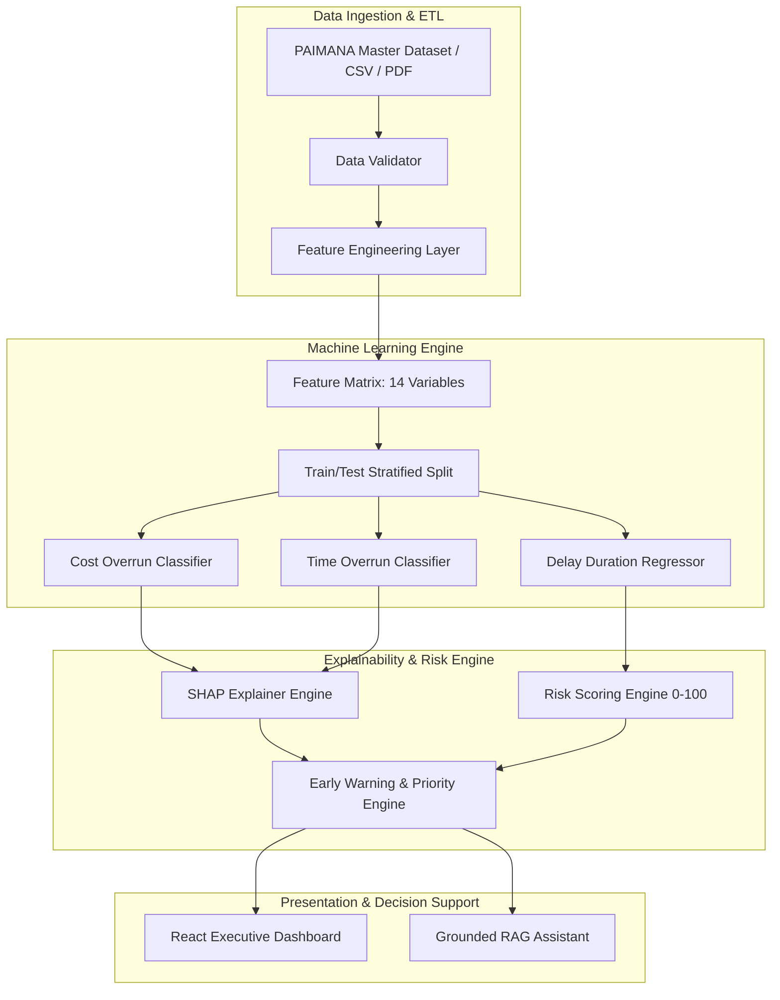

<div align="center">

# 🏛️ DRISHTI

### **Infrastructure Project Intelligence & Early Warning System**

**Smart India Hackathon 2026 | Problem Statement 26103**  
*Ministry of Statistics and Programme Implementation (MoSPI) • Data Informatics & Innovation Division (DIID)*

[](https://paimana-proj.mospi.gov.in/ReportPage)
[](https://sih.gov.in)
[](https://sih.gov.in)
[](file:///c:/Users/sachi/Downloads/SIH26103/frontend)
[](file:///c:/Users/sachi/Downloads/SIH26103/backend)
[](file:///c:/Users/sachi/Downloads/SIH26103/backend/app/models)

---

[🚀 Live Demo (Local)](#-how-to-run) • [🎥 Demo Video (Coming Soon)](#) • [📊 Local Dashboard: http://localhost:5173](http://localhost:5173) • [📚 Technical Docs](#-system-architecture)

</div>

---

## 💡 One-Line Value Proposition

$$\text{Monitor} \longrightarrow \text{Predict} \longrightarrow \text{Identify Risk} \longrightarrow \text{Generate Early Warning} \longrightarrow \text{Support Action}$$

> **DRISHTI** transforms infrastructure project monitoring from **reactive, retrospective status reporting** into a **predictive, explainable, and prescriptive decision-support ecosystem** for MoSPI officers and project managers.

---

## 🎯 SIH Problem Statement 26103 Context

In central infrastructure monitoring, the **Infrastructure and Project Monitoring Division (IPMD)** of MoSPI tracks major ongoing central sector projects ($\ge ₹150\text{ Cr}$) via the **PAIMANA / OCMS** platform. 

### The Core Challenge
Existing monitoring systems are primarily **descriptive**—they record *what has already happened* (e.g., recorded cost escalation, past milestone delays). By the time a project is flagged as delayed, critical cost overruns have already materialized.

### The DRISHTI Solution
DRISHTI introduces an **AI/ML Intelligence Layer** on top of PAIMANA project records:
1. **Predicts** cost and time overruns before they escalate.
2. **Decomposes** project risks into a unified **0–100 Risk Score**.
3. **Explains** root causes using **SHAP (SHapley Additive exPlanations)** feature attribution.
4. **Prioritizes** projects into **P1–P4 Alert Tiers** with prescriptive administrative recommendations.

---

## ⚠️ The Problem: Retrospective vs. Predictive Monitoring

### Traditional Monitoring Flow (Retrospective)

* **Limitation**: Bottlenecks like Right-of-Way (RoW) conflicts or low execution velocity are detected only after schedule targets are missed.

### DRISHTI Intelligent Flow (Predictive & Prescriptive)


---

## 📌 DRISHTI at a Glance

| SIH 26103 Expected Outcome | Repository Implementation Status | Technical Details |
| :--- | :---: | :--- |
| **1. Cost Overrun Prediction Model** | <span style="color:green">**Implemented**</span> | Evaluates XGBoost, Random Forest, Decision Tree, Logistic Regression for binary & multi-class cost escalation prediction. |
| **2. Time Overrun Prediction Model** | <span style="color:green">**Implemented**</span> | Predicts schedule delay probability and expected delay duration in months using `XGBRegressor`. |
| **3. Project Risk Scoring Framework** | <span style="color:green">**Implemented**</span> | Weighted multi-component 0–100 Risk Score (Cost 25%, Schedule 25%, Progress Gap 20%, Mismatch 15%, Milestone 15%). |
| **4. Early Warning Alert System** | <span style="color:green">**Implemented**</span> | Automated trigger detection (Milestones, Financial Mismatch >15%, Land Lag) mapping projects to P1–P4 Priority Tiers. |
| **5. Benchmarking & Comparative Analytics** | <span style="color:green">**Implemented**</span> | Peer comparison against median performance in sector and cost scale cohorts (Medium, Large, Mega). |
| **6. Cost Escalation Driver Analysis** | <span style="color:green">**Implemented**</span> | SHAP feature attribution & CUF Variable Ablation Experiment comparing standard 9 fields vs 14 CUF+ variables. |
| **7. AI-Powered Monitoring Dashboard** | <span style="color:green">**Implemented**</span> | Clean white/light executive web interface with Interactive Leaflet GIS Map, Recharts EDA, and Priority Review Queue. |
| **8. LLM Project Intelligence Assistant** | <span style="color:green">**Implemented**</span> | Grounded RAG query portal providing natural language answers cited directly from database records. |
| **9. Documentation & Deployment Framework** | <span style="color:green">**Implemented**</span> | Clean modular architecture, REST APIs, TypeScript types, and local setup scripts. |

---

## ✨ Key Features

### 📊 1. Multi-Sector Infrastructure Portfolio Tracking
- Tracks **1,981 Central Sector Infrastructure Projects** across **17 Central Ministries** and **22 Infrastructure Sectors**.
- Displays national macro financial metrics: Sanctioned Original Cost ($\sim ₹37.13\text{ Lakh Cr}$), Revised Cost ($\sim ₹42.78\text{ Lakh Cr}$), and Cumulative Expenditure ($\sim ₹20.36\text{ Lakh Cr}$).

### 💰 2. Cost & Time Overrun Predictive Analytics
- **Cost Overrun Classifier**: Identifies likelihood of project cost exceeding original sanction by $>5\%$.
- **Schedule Delay Classifier**: Identifies likelihood of delay exceeding $>3\text{ months}$.
- **Delay Duration Regressor**: Estimates expected delay duration in months with lower and upper confidence bounds.

### ⚠️ 3. Multi-Component 0–100 Risk Scoring Engine
- Calculates a unified **Overall Risk Score (0–100)** broken down into 5 components:
  - **Cost Risk (25%)**: Predictive cost overrun probability.
  - **Schedule Risk (25%)**: Predictive time delay probability.
  - **Progress Gap Risk (20%)**: Variance between expected project age progress and physical completion.
  - **Financial-Progress Mismatch Risk (15%)**: Penalty when financial expenditure significantly leads physical completion.
  - **Milestone Delay Risk (15%)**: Ratio of delayed milestones to total scheduled milestones.
- Customizable risk weights and thresholds via real-time configuration dialog (`/api/config`).

### 🔔 4. Early Warning & Prescriptive Decision Support
- Flags **5 Early Warning Signal Triggers**:
  1. *Severe Milestone Slippage* ($>40\%$ delayed milestones).
  2. *Financial-Progress Execution Mismatch* (Financial progress leads physical by $>15\%$).
  3. *Sluggish Execution Velocity* (Physical progress $<40\%$ past mid-timeline).
  4. *Land Acquisition & RoW Lag* ($<70\%$ land handed over).
  5. *Active Court Litigations & Stay Orders*.
- Assigns **P1 (Critical)**, **P2 (High)**, **P3 (Moderate)**, and **P4 (Low)** priority tiers.
- Delivers actionable prescriptive recommendations for inter-ministerial task force meetings or site audits.

### 📈 5. Sector & Scale Benchmarking Module
- Compares any selected project against sector medians and scale cohorts:
  - **Medium Scale**: $₹150\text{ Cr} - ₹800\text{ Cr}$
  - **Large Scale**: $₹800\text{ Cr} - ₹3,500\text{ Cr}$
  - **Mega Scale**: $>₹3,500\text{ Cr}$
- Evaluates whether a project is *Outperforming*, *At Peer Median*, or *Underperforming*.

### 🔎 6. Explainable AI (SHAP) & CUF Ablation Experiment
- **SHAP Local Risk Drivers**: Explains the top 5 positive/negative feature impacts driving risk for any individual project.
- **Common Upload Form (CUF) Variable Experiment**: Empirical comparison showing that augmenting 9 standard CUF fields with 5 proposed variables (Land Acquisition %, Contractor Rating, Litigations, Payment Delays, Regulatory Clearances) improves model ROC-AUC by **+3.8%** and Recall by **+5.2%**.

### 📄 7. Multi-Format Data Ingestion (CSV / Excel / PDF + OCR)
- Supports structured CSV and Excel dataset uploads.
- **PAIMANA PDF Report Extraction**: Ingests monthly PAIMANA PDF reports using `pdfplumber`, `pypdf`, and text/table parsing fallback with OCR detection.
- Includes automated data quality validation reporting (missing values, duplicate IDs, invalid dates, negative costs, expenditure anomalies).

### 🤖 8. Grounded RAG Project Intelligence Assistant
- Natural language query portal (`/api/assistant`) allowing officers to ask questions (e.g., *"Which projects are at critical risk?"*, *"Show sector delay risk"*).
- Synthesizes responses strictly grounded in database records with cited project IDs.

---

## 🤖 AI/ML Pipeline & Architecture



### ML Models & Training Details

| Model Target | Primary Algorithm | Evaluated Baselines | Key Input Features | Output Metric |
| :--- | :--- | :--- | :--- | :--- |
| **Cost Overrun Classifier** | **XGBoost** (`XGBClassifier`) | Random Forest, Decision Tree, Logistic Regression | 14 Numerical Features (Cost, Progress %, Velocity, Mismatch %, Milestones, Land %, Contractor Rating) | Binary Probability (%) & Risk Drivers |
| **Time Overrun Classifier** | **XGBoost** (`XGBClassifier`) | Random Forest, Decision Tree, Logistic Regression | 14 Numerical Features (Planned Duration, Project Age, Progress Velocity, Milestone Delay Rate) | Binary Probability (%) & Delay Risk |
| **Delay Duration Regressor** | **XGBoost** (`XGBRegressor`) | Linear Regression, Random Forest Regressor | Project Age, Milestone Delay Rate, Progress Velocity, Land Ratio | Expected Delay (Months) & MAE |
| **Explainability (XAI)** | **SHAP** (`shap.TreeExplainer`) | Feature Importance | Project Specific Input Vector | Local Feature Impact Scores (+/- Risk) |

> *Note: Model evaluation metrics (Accuracy, Precision, Recall, F1-Score, ROC-AUC, PR-AUC, MAE, $R^2$) are dynamically calculated upon system startup and dataset initialization.*

---

## 📊 Risk Engine & Formula Breakdown

The **Unified Project Risk Score (0–100)** is computed using the following component formulation:

$$\text{Risk Score} = \min\left(100, \sum_{i} (C_i \times W_i)\right)$$

### Component Formulations

1. **Cost Risk ($C_{\text{cost}}$)**:
   $$C_{\text{cost}} = \min(100, \text{Probability}_{\text{cost\_overrun}})$$

2. **Schedule Risk ($C_{\text{sched}}$)**:
   $$C_{\text{sched}} = \min(100, \text{Probability}_{\text{time\_overrun}})$$

3. **Progress Gap Risk ($C_{\text{prog}}$)**:
   $$\text{Expected Progress} = \min\left(100, \frac{\text{Project Age}}{\text{Planned Duration}} \times 100\right)$$
   $$C_{\text{prog}} = \min\left(100, \max(0, \text{Expected Progress} - \text{Physical Progress}) \times 1.5\right)$$

4. **Financial-Progress Mismatch Risk ($C_{\text{mismatch}}$)**:
   $$C_{\text{mismatch}} = \min\left(100, \max(0, \text{Financial Progress} - \text{Physical Progress}) \times 2.5\right)$$

5. **Milestone Delay Risk ($C_{\text{milestone}}$)**:
   $$C_{\text{milestone}} = \min\left(100, \frac{\text{Delayed Milestones}}{\text{Total Milestones}} \times 100\right)$$

### Default Component Weights

$$\text{Overall Score} = 0.25 \cdot C_{\text{cost}} + 0.25 \cdot C_{\text{sched}} + 0.20 \cdot C_{\text{prog}} + 0.15 \cdot C_{\text{mismatch}} + 0.15 \cdot C_{\text{milestone}}$$

### Risk Tiers
- 🟢 **LOW**: $0.0 - 24.9$
- 🟡 **MODERATE**: $25.0 - 49.9$
- 🟠 **HIGH**: $50.0 - 74.9$
- 🔴 **CRITICAL**: $75.0 - 100.0$

---

## 🔔 Early Warning Alert & Prioritization System

Projects are classified into four alert priority tiers:

- 🔴 **P1 — CRITICAL (Immediate Review Required)**: Risk Score $\ge 75$ OR (Risk Score $\ge 65$ and Financial Exposure $> ₹2,000\text{ Cr}$).
- 🟠 **P2 — HIGH (Priority Monitoring)**: Risk Score $\ge 50$ OR (Risk Score $\ge 40$ and Financial Exposure $> ₹1,000\text{ Cr}$).
- 🟡 **P3 — MODERATE (Regular Oversight)**: Risk Score $\ge 25$.
- 🟢 **P4 — LOW (Routine Monitoring)**: Risk Score $< 25$.

### Synthetic Illustration (Non-Government Example)
```
[P1 ALERT FLAG] PRJ-2026-0042 — Metro Expansion Project
• Risk Score: 84.2/100 (CRITICAL) | Financial Exposure: ₹3,450 Cr
• Triggered Signals:
  - Severe Milestone Slippage: 65% of milestones delayed.
  - Financial Progress Mismatch: Financial (72%) leads Physical (48%) by +24%.
• Prescriptive Recommendation:
  - Conduct financial progress audit and convene joint task force for Land Handover.
```

---

## 💻 Dashboard Interface Overview

The frontend is built as a **clean, sober, executive-grade government-tech platform**:

- **Positioning Header**: Institutional title (**DRISHTI**, `MoSPI • SIH26103`) with system status indicators.
- **5 KPI Highlight Cards**: Monitored Projects, Original Cost, Revised Cost, Total Expenditure, and Overall Escalation %.
- **Sector-Wise Delay Risk Chart**: Recharts bar chart displaying average risk scores across 22 infrastructure sectors.
- **National Infrastructure GIS Risk Map**: Interactive Leaflet map utilizing **CartoDB Voyager** light tiles displaying color-coded risk markers for projects across India.
- **Priority Review Queue**: Ranked table prioritizing P1/P2 projects for officer intervention.
- **Project Deep Dive Modal**: Modal window revealing financial details, SHAP risk drivers, risk decomposition, and benchmarking against peer cohorts.

---

## 🛠️ Technology Stack

| Layer | Technology | Purpose |
| :--- | :--- | :--- |
| **Frontend Framework** | **React 19** + **TypeScript** | Component-driven user interface |
| **Build Tool & Bundler** | **Vite 8** | High-performance development server & production bundler |
| **Styling & Design** | **Tailwind CSS 4** + **PostCSS** | Government-grade light mode styling |
| **Mapping & GIS** | **Leaflet** + **React-Leaflet** | Interactive geospatial project risk mapping (CartoDB Voyager) |
| **Data Visualization** | **Recharts 3** | Interactive sector risk & EDA charts |
| **Icons & UI Utilities** | **Lucide-React**, **clsx**, **tailwind-merge** | Consistent executive iconography |
| **Backend Framework** | **FastAPI** + **Uvicorn** | High-throughput asynchronous Python REST API server |
| **ML & Analytics** | **XGBoost**, **Scikit-Learn** | Predictive classification, regression, and cross-validation |
| **Explainable AI (XAI)** | **SHAP** | Feature contribution calculation per project |
| **Data Processing** | **Pandas**, **NumPy** | High-performance ETL, feature engineering, & aggregations |
| **PDF Extraction & OCR** | **pdfplumber**, **PyPDF** | Parsing text, tables, and scanned PDF reports |
| **API Client** | **Axios** | HTTP requests between React frontend and FastAPI backend |

---

## 📁 Repository Structure

```
SIH26103/
├── .gitattributes              # Standardized LF line endings configuration
├── .gitignore                  # Git ignore definitions
├── README.md                   # System documentation & SIH evaluation guide
├── backend/                    # Python FastAPI Backend & ML Engine
│   └── app/
│       ├── __init__.py
│       ├── main.py             # FastAPI entrypoint, routes, & startup initialization
│       ├── assistant/
│       │   └── rag_assistant.py# Grounded RAG query assistant over project records
│       ├── data/
│       │   ├── features.py     # Feature extraction & target engineering pipeline
│       │   ├── generator.py    # Synthetic 1,981 project PAIMANA dataset generator
│       │   ├── pdf_ocr.py      # PAIMANA PDF report parsing & OCR extraction layer
│       │   ├── sector_utils.py # Sector data normalization & aggregation utilities
│       │   └── validator.py    # Data quality validator & anomaly detector
│       ├── engine/
│       │   ├── benchmarking.py # Peer sector & cost scale benchmarking engine
│       │   ├── early_warning.py# Early warning signal detection & priority assigner
│       │   └── risk_scoring.py # 0-100 multi-component risk scoring engine
│       └── models/
│           ├── cuf_experiment.py # Common Upload Form (CUF) ablation experiment
│           └── ml_engine.py    # XGBoost, Random Forest, Decision Tree & SHAP engine
└── frontend/                   # React 19 + TypeScript + Vite Frontend
    ├── index.html              # HTML shell
    ├── package.json            # Node.js dependencies & scripts
    ├── vite.config.ts          # Vite configuration
    └── src/
        ├── App.tsx             # Main layout, tab navigation, & modal states
        ├── main.tsx            # React application entrypoint
        ├── components/
        │   ├── AIAssistant.tsx         # AI Query Assistant portal interface
        │   ├── BenchmarkingModule.tsx  # Cross-sector benchmarking table & cards
        │   ├── ConfigModal.tsx         # Risk weights & thresholds slider dialog
        │   ├── CUFExperimentModule.tsx # CUF variable ablation comparison module
        │   ├── DataUploadModule.tsx    # CSV/Excel & PDF+OCR ingestion portal
        │   ├── EarlyWarningModule.tsx  # Early Warning & alert priority tabs (P1-P4)
        │   ├── ExecutiveOverview.tsx   # Dashboard banner, KPIs, GIS map, & review queue
        │   ├── ModelStatusModal.tsx    # Model status & global feature importance report
        │   ├── Navbar.tsx              # Executive light header & navigation bar
        │   ├── ProjectDetailModal.tsx  # Project Deep Dive modal (SHAP & decomposition)
        │   ├── ProjectTable.tsx        # Portfolio project table with filters & pagination
        │   └── SectorAnalytics.tsx     # Exploratory Data Analysis (EDA) charts
        ├── services/
        │   └── api.ts                  # Axios API service client
        └── types/
            └── index.ts                # TypeScript interfaces & type definitions
```

---

## ⚡ 2-Minute Judge Quick Demo

Follow these simple steps to evaluate the DRISHTI platform:

1. **Executive Overview**: Observe the 5 national KPI cards and the interactive **National Infrastructure Risk Map** rendering project pins across India.
2. **Sector Delay Risk**: Review the **Delay Risk by Sector** bar chart to see sector-level risk concentrations (e.g., Railways vs Roads).
3. **Priority Review Queue**: Click on any project flagged as **P1 Critical** to open the **Project Deep Dive Modal**.
4. **Inspect Explainable AI (SHAP)**: In the modal, review the **Top Risk Drivers (SHAP)** to see exact feature contributions (e.g., *Financial-Progress Mismatch Gap*, *Milestone Slippage Rate*).
5. **Early Warning Module**: Switch to the **Early Warning Engine** tab and toggle between **P1, P2, P3, and P4** priority filters.
6. **PDF / OCR Data Ingestion**: Switch to the **Data Upload** tab and test uploading a sample dataset or PDF report to view the automated Data Quality & Anomaly Report.
7. **AI Assistant**: Open the **AI Intelligence Portal** tab and click any prompt chip (e.g., *"Which projects are at critical risk?"*) to see grounded record citations.

---

## 🚀 How to Run

### Prerequisites
- **Python**: `3.10+` (Python 3.13 tested)
- **Node.js**: `v18+` or `v20+`
- **npm**: `v9+` or `v10+`

---

### Step 1: Clone Repository
```bash
git clone https://github.com/sachinb2877-sudo/DRISHTI.git
cd DRISHTI
```

---

### Step 2: Set Up & Start Backend (FastAPI)

1. Open a terminal in the project root and navigate to `backend`:
   ```bash
   cd backend
   ```

2. Create and activate a Python virtual environment:
   ```bash
   # On Windows PowerShell:
   python -m venv venv
   .\venv\Scripts\Activate.ps1

   # On Linux / macOS:
   python3 -m venv venv
   source venv/bin/activate
   ```

3. Install required Python packages:
   ```bash
   pip install fastapi uvicorn pandas numpy scikit-learn xgboost shap pypdf pdfplumber openpyxl
   ```

4. Start the FastAPI backend server:
   ```bash
   python -m uvicorn app.main:app --host 127.0.0.1 --port 8000 --reload
   ```
   *The backend will start at `http://127.0.0.1:8000` and automatically initialize the 1,981 project PAIMANA dataset and train the ML models.*

---

### Step 3: Set Up & Start Frontend (React + Vite)

1. Open a new terminal window, navigate to `frontend`:
   ```bash
   cd frontend
   ```

2. Install Node modules:
   ```bash
   npm install
   ```

3. Start the Vite development server:
   ```bash
   npm run dev
   ```
   *The frontend application will run at `http://localhost:5173`.*

---

### Step 4: Verify Full System Build (Optional)
To verify TypeScript compilation and bundle creation:
```bash
cd frontend
npm run build
```

---

## 🎯 SIH 26103 Alignment Matrix

| SIH Requirement | Official Problem Statement Objective | DRISHTI Implementation | Alignment Status |
| :--- | :--- | :--- | :---: |
| **Predictive Monitoring** | Move from descriptive status reporting to predictive analytics. | Implements XGBoost models predicting binary cost/time overruns & delay months. | <span style="color:green">**100% Aligned**</span> |
| **Cost Overrun Model** | Identify cost escalation risk early. | Predicts cost overrun probability ($>5\%$) and classifies risk severity. | <span style="color:green">**100% Aligned**</span> |
| **Time Overrun Model** | Predict schedule delays. | Estimates expected delay duration in months using `XGBRegressor`. | <span style="color:green">**100% Aligned**</span> |
| **Risk Scoring** | Unified framework for project risk. | Multi-component 0–100 Risk Score with customizable component weights. | <span style="color:green">**100% Aligned**</span> |
| **Early Warning System** | Generate alerts for proactive intervention. | Automatically categorizes projects into P1–P4 tiers with prescriptive advice. | <span style="color:green">**100% Aligned**</span> |
| **Benchmarking** | Comparative performance across cohorts. | Evaluates project metrics against peer sector medians & cost scale cohorts. | <span style="color:green">**100% Aligned**</span> |
| **Cost Escalation Drivers** | Analyze drivers causing budget expansion. | Local SHAP feature attribution & CUF Variable Ablation Experiment. | <span style="color:green">**100% Aligned**</span> |
| **AI Dashboard** | Integrated web monitoring platform. | Executive React dashboard with GIS map, Recharts EDA, and project deep dives. | <span style="color:green">**100% Aligned**</span> |
| **Project Intelligence** | LLM/Query assistant for project records. | Grounded RAG assistant delivering cited natural language answers. | <span style="color:green">**100% Aligned**</span> |
| **Deployment Framework** | Open-source software stack. | Built using Python, FastAPI, React, TypeScript, and open-source ML libraries. | <span style="color:green">**100% Aligned**</span> |

---

## 💡 Key Technical Innovations & USPs

1. **Shift from Retrospective to Predictive Governance**: Replaces traditional static status tracking with proactive ML risk forecasting.
2. **Explainable AI (SHAP)**: Avoids "black box" machine learning by generating localized feature explanations for every single project.
3. **Common Upload Form (CUF) Variable Ablation Study**: Demonstrates empirical justification for adding 5 critical variables (Land Acquisition %, Contractor Rating, Litigations, Payment Delays, Regulatory Clearances) to national project monitoring forms.
4. **Dual Data Ingestion (Structured + PDF/OCR)**: Enables automated data ingestion even when structured API feeds are unavailable by parsing scanned PDF reports via OCR.
5. **Grounded RAG Assistant**: Solves AI hallucination risks by strictly constraining natural language query responses to verified database rows.

---

## 🔒 Security, Data Quality & Reliability

- **Strict Schema Validation**: Inputs parsed and validated via Pydantic (`BaseModel`) and Pandas schema checks.
- **Data Quality Anomaly Detector**: Scans incoming datasets for missing values, duplicate IDs, invalid date sequences, negative costs, and percentage bounds.
- **Zero Temporal Data Leakage**: Feature engineering strictly uses baseline parameters (start date, planned duration, current age) to compute target variables without future information contamination.
- **Single-Class Classifiers Safeguard**: Includes automatic boundary row injection to prevent model crashes when evaluating single-class custom uploaded datasets.

---

## 🔮 Future Scope & Roadmap

- **Live PAIMANA API Integration**: Direct OAuth2 REST synchronization with MoSPI PAIMANA database endpoints.
- **Satellite & GIS Remote Sensing Sync**: Integrating satellite imagery analysis to cross-verify physical progress claims against ground reality.
- **Automated Communication Alerts**: Instant SMS / WhatsApp / Email alert dispatch to NITI Aayog, MoSPI officers, and Ministry Secretaries for P1 Critical flags.
- **Cloud Microservices Deployment**: Containerization via Docker & Kubernetes for multi-tenant deployment across State Infrastructure Departments.

---

## 📚 Official References

1. **MoSPI PAIMANA Official Platform**: [https://paimana-proj.mospi.gov.in/ReportPage](https://paimana-proj.mospi.gov.in/ReportPage)
2. **Ministry of Statistics and Programme Implementation (MoSPI)**: [https://mospi.gov.in](https://mospi.gov.in)
3. **Smart India Hackathon (SIH)**: [https://sih.gov.in](https://sih.gov.in)

---

## ⚡ DRISHTI — Judge Quick View Summary

| Evaluation Dimension | Summary Details |
| :--- | :--- |
| **Problem Statement** | **SIH 26103**: Use case on web-based integrated project-monitoring platform |
| **Organization** | Ministry of Statistics and Programme Implementation (MoSPI) • DIID |
| **Core Innovation** | Transition from descriptive status reporting to **predictive & prescriptive AI governance** |
| **ML Engine** | XGBoost Classification, XGBoost Regression, Random Forest, Decision Tree, & SHAP XAI |
| **Risk Scoring** | Unified **0–100 Risk Score** with 5-component weighted decomposition |
| **Early Warning** | Automated **P1–P4 Alert Tiers** with prescriptive administrative recommendations |
| **Data Ingestion** | Structured CSV/Excel & PAIMANA **PDF Report Extraction with OCR** |
| **UI Experience** | Clean white/light government-tech executive dashboard with interactive Leaflet GIS map |
| **Source Repository** | [https://github.com/sachinb2877-sudo/DRISHTI](https://github.com/sachinb2877-sudo/DRISHTI) |

$$\text{Monitor} \longrightarrow \text{Predict} \longrightarrow \text{Identify Risk} \longrightarrow \text{Warn Early} \longrightarrow \text{Support Better Decisions}$$
